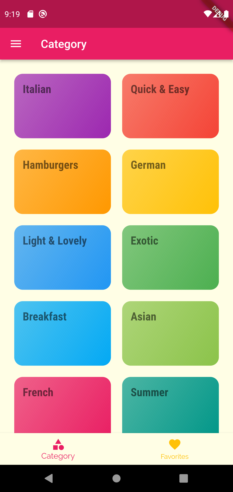
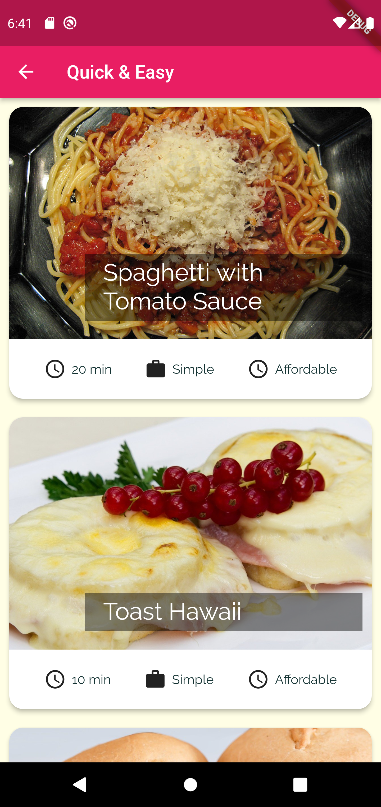
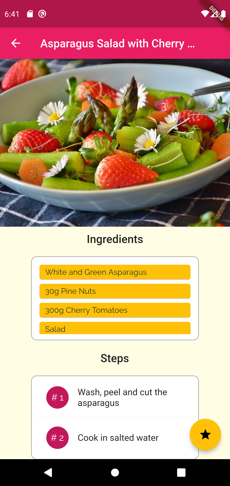
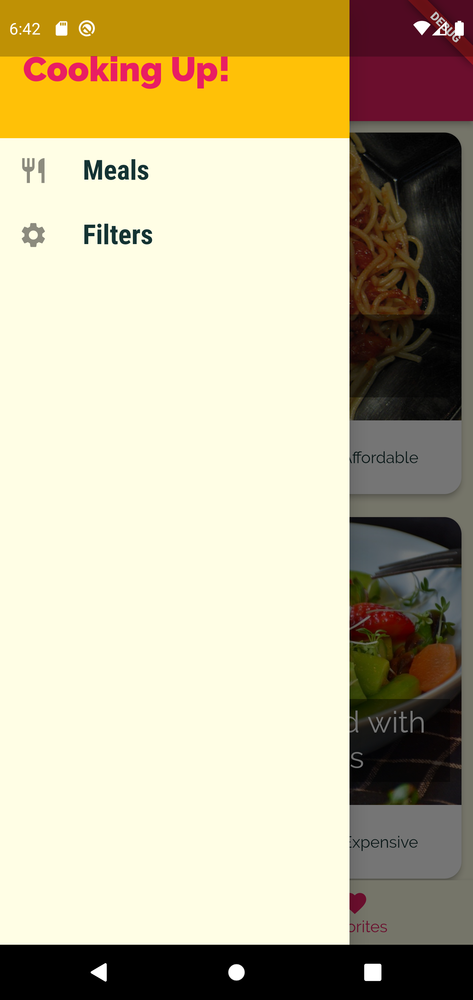
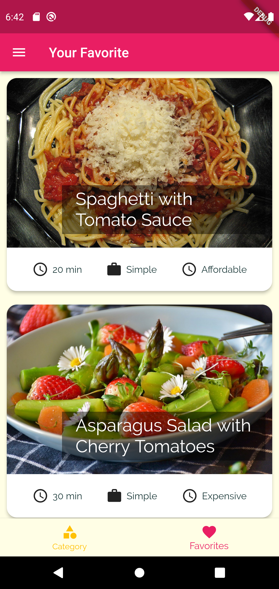
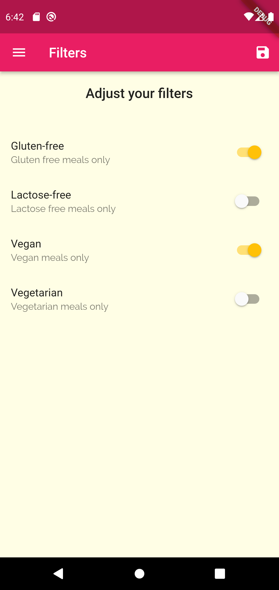

# Meal Application

This is a starter project for anyone who wants get a hands-on experience on Flutter.

## Things that have covered

- StateFull and StateLess Class
- Navigation with Tabbar, Drawer, routes
- Software architecture with seperate Model, Screens and Widgets
- Passing data, function back and forth to different Widgets and Screens
- Some lifecycle hooks like initState and didChangeDependecies
- Beautiful UI with Grid, Card, List, Custom Theme, Custom Font, Switches and many more

## Here's all the screens of the app

Home:

Category:

Category Detail:

Drawer:

Favorite:

Filters:

